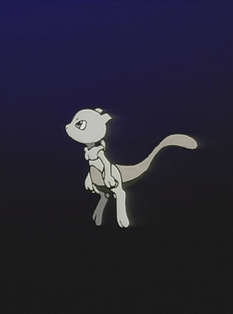

<h1 align="center">こんにちは 👋</h1>

<h3 align="center">Full Stack Developer · .NET + React</h3>

<div align="center">
  <a href="https://www.linkedin.com/in/bruno-piter-1130aa276/" target="_blank">
    
  </a>
  <a href="mailto:piterbruno97@gmail.com" target="_blank">
    
  </a>
  <a href="https://github.com/Bruno-Piter" target="_blank">
    
  </a>
  <br/>
  
</div>

---

<div align="center">
  
  
</div>

<table>
<tr>
<td valign="top" width="58%">

```jsx
import { Developer, Monster } from "@bruno/profile";

const bruno = {
  name: "Bruno Piter",
  role: "Full Stack Developer",
  currentlyLearning: [
    { name: "Software Engineering - USP/Esalq", progress: "██········ 20%" },
    { name: "Google UX Design Professional", progress: "██········ 20%" },
  ],
  languages: ["pt_BR", "en_US", "ja_JP"],
  stack: {
    frontend: ["React", "TypeScript", "HTML", "CSS"],
    backend: ["C#", ".NET Core", "ASP.NET MVC"],
    data: ["SQL Server", "PostgreSQL", "MySQL", "Oracle", "MongoDB"],
  },
  concepts: ["POO", "DDD", "CQRS", "MediatR", "Clean Architecture"],
};

export default function Profile() {
  return (
    <Developer {...bruno}>
      <Monster status="fueling the code ⚡" />
      {/* Thanks for stopping by — hope you find my work interesting! */}
    </Developer>
  );
}
```

</td>
<td valign="top" width="42%" align="center">
  
  <br/>
  
  <br/>
  
</td>
</tr>
</table>

###

<h2 align="center">Projects</h2>

<br/>

<table>
  <tr>
    <td width="50%" valign="top" bgcolor="#350952">
    <br/>
      <p align="center">
        
      </p>
      <p align="center">
        <font color="#ffffff">An evolving intelligent assistant designed to blend automation, a clean interface, and a product experience with personality.</font>
      </p>
      <br/>
      <p align="center">
        <font color="#ffffff"><sub><b>Focus:</b> AI assistant · automation </sub></font>
      </p>
      <p align="center">
        <a href="https://github.com/Bruno-Piter/A.I.K.O.">
          
        </a>
      </p>
    </td>
    <td width="50%" valign="top">
    <br/>
      <p align="center">
        
      </p>
      <p align="center">
        A command dashboard for organizing flows, monitoring actions, and centralizing decisions in one control-room experience.
      </p>
      <p align="center">
        <sub><b>Focus:</b> dashboard · orchestration · workflow</sub>
      </p>
      <p align="center">
        <a href="https://github.com/Bruno-Piter/Mission-Control">
          
        </a>
      </p>
    </td>
  </tr>
  <tr>
    <td width="50%" valign="top">
    <br/>
      <p align="center">
        
      </p>
      <p align="center">
        A Pokémon-inspired experience for exploring data, details, and navigation through a more playful visual interface.
      </p>
      <p align="center">
        <sub><b>Focus:</b> UI · API consumption · interactive catalog</sub>
      </p>
      <p align="center">
        <a href="https://github.com/Bruno-Piter/pokedex-ultra">
          
        </a>
      </p>
    </td>
    <td width="50%" valign="top">
    <br/>
      <p align="center">
        
      </p>
      <p align="center">
        A study project about ransomware and malware behavior, focused on analysis, learning, and security awareness.
      </p>
      <p align="center">
        <sub><b>Focus:</b> cybersecurity · malware analysis · research</sub>
      </p>
      <p align="center">
        <a href="https://github.com/Bruno-Piter/ShinigamiLocker---malware-ransomware-">
          
        </a>
      </p>
    </td>
  </tr>
</table>

###

<h2 align="center">🎮 Let's play Pokémon ? 🎮</h2>

<div align="center">

<table width="390">
  <tr>
    <td align="center" bgcolor="red">
      <br/>
      <table width="315">
        <tr>
          <td bgcolor="#151515" align="center">
            <br/>
            
            <br/>
            <sub><font color="#9CA3AF"><b>GAME BOY</b></font></sub>
            <br/>
          </td>
        </tr>
      </table>
      <br/>
      <table width="315">
        <tr>
          <td width="120" align="center">
            <table>
              <tr>
                <td width="48"></td>
                <td width="48" align="center"><a href="https://toy.cloudreve.org/control?button=2&callback=https://github.com/Bruno-Piter"></a></td>
                <td width="48"></td>
              </tr>
              <tr>
                <td width="48" align="center"><a href="https://toy.cloudreve.org/control?button=1&callback=https://github.com/Bruno-Piter"></a></td>
                <td width="48"></td>
                <td width="48" align="center"><a href="https://toy.cloudreve.org/control?button=0&callback=https://github.com/Bruno-Piter"></a></td>
              </tr>
              <tr>
                <td width="48"></td>
                <td width="48" align="center"><a href="https://toy.cloudreve.org/control?button=3&callback=https://github.com/Bruno-Piter"></a></td>
                <td width="48"></td>
              </tr>
            </table>
          </td>
          <td width="75" align="center">
            <br/>
            <a href="https://toy.cloudreve.org/control?button=6&callback=https://github.com/Bruno-Piter"></a>
            <br/>
            <a href="https://toy.cloudreve.org/control?button=7&callback=https://github.com/Bruno-Piter"></a>
          </td>
          <td width="120" align="center">
            <br/>
            <a href="https://toy.cloudreve.org/control?button=5&callback=https://github.com/Bruno-Piter"></a>
            
            <a href="https://toy.cloudreve.org/control?button=4&callback=https://github.com/Bruno-Piter"></a>
          </td>
        </tr>
      </table>
      <br/>
    </td>
  </tr>
</table>

</div>

###
