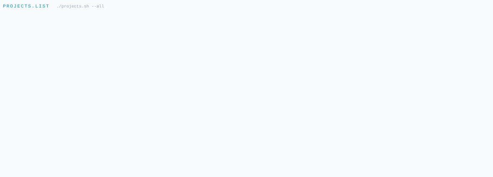

  
    
  
  
  
   
  
  

---

  
  

<picture>
  <source media="(prefers-color-scheme: dark)" srcset="assets/visual-dark.svg?v=3">
  <source media="(prefers-color-scheme: light)" srcset="assets/visual-light.svg?v=3">
  
</picture>

<table>
<tr>
<td valign="middle" width="58%">
  
</td>
<td valign="middle" width="42%" align="center">
  
</td>
</tr>
</table>

  
  

###

<h2 align="center">Projects</h2>

<picture>
  <source media="(prefers-color-scheme: dark)" srcset="assets/projects-dark.svg">
  <source media="(prefers-color-scheme: light)" srcset="assets/projects-light.svg">
  
</picture>

  <a href="https://github.com/Bruno-Piter/A.I.K.O.">A.I.K.O.</a>
  &nbsp;·&nbsp;
  <a href="https://github.com/Bruno-Piter/Mission-Control">Mission Control</a>
  &nbsp;·&nbsp;
  <a href="https://github.com/Bruno-Piter/ShinigamiLocker---malware-ransomware-">ShinigamiLocker</a>
  &nbsp;·&nbsp;
  <a href="https://github.com/Bruno-Piter/pokedex-ultra">pokedex-ultra</a>

###

<h2 align="center">🎮 Let's play Pokémon ? 🎮</h2>

<table width="390">
  <tr>
    <td align="center" bgcolor="red">
       
      <table width="315">
        <tr>
          <td bgcolor="#151515" align="center">
             
            
             
            <b>GAME BOY</b>
             
          </td>
        </tr>
      </table>
       
      <table width="315">
        <tr>
          <td width="120" align="center">
            <table>
              <tr>
                <td width="48"></td>
                <td width="48" align="center"></td>
                <td width="48"></td>
              </tr>
              <tr>
                <td width="48" align="center"></td>
                <td width="48"></td>
                <td width="48" align="center"></td>
              </tr>
              <tr>
                <td width="48"></td>
                <td width="48" align="center"></td>
                <td width="48"></td>
              </tr>
            </table>
          </td>
          <td width="75" align="center">
             
            
             
            
          </td>
          <td width="120" align="center">
             
            
            
            
          </td>
        </tr>
      </table>
       
    </td>
  </tr>
</table>

###
